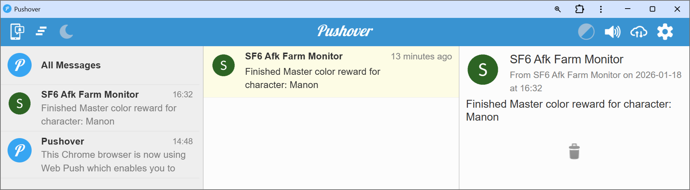

# SF6 Afk Farm Monitor

This app helps the SF6 Afk Farm by checking for

1. When the afk farm is stuck, often due to Capcom error codes or opponent disconnects.
2. When a new Master color is unlocked, and it is time to swap characters.

To achieve this, this app polls the Capcom Buckler API for "battle counts" of each character. Once one of the above two
conditions are met, then a notification is sent via Pushover.

## First Time Setup

1. Make a copy of the `example.toml`. Name the new file `config.toml`.
2. Inside `config.toml`, update the following variables:
    1. user_code
    2. buckler_id, buckler_r_id, buckler_praise_date
    3. pushover_app_key, pushover_user_key
3. Feel free to change any other settings inside the TOML file, or leave them at their defaults.

## Getting Buckler Variables

When you log into the CFN website (https://www.streetfighter.com/6/buckler/en/), there are three Buckler variables
stored inside the Request Cookies. You can use your browser's Network Inspector to inspect your HTTP requests and copy
these variables.

## Usage

Step 1: Run the app in your terminal:

```shell
uv sync
uv run python app.py
```

Example running output:

```Powershell
2026-01-18 16:21:23,839 | INFO | __main__ | Scheduling task for every 60 seconds...
2026-01-18 16:28:28,127 | INFO | task | Character (Manon) has a new battle count: 96 -> 97
2026-01-18 16:29:28,700 | INFO | task | Character (Manon) has a new battle count: 97 -> 98
2026-01-18 16:31:29,952 | INFO | task | Character (Manon) has a new battle count: 98 -> 99
2026-01-18 16:32:30,535 | INFO | task | Character (Manon) has a new battle count: 99 -> 100
2026-01-18 16:32:30,535 | INFO | task | Finished Master color reward for character: Manon
2026-01-18 16:33:31,281 | INFO | task | Character (Manon) has a new battle count: 100 -> 101
2026-01-18 16:35:32,197 | INFO | task | Character (Kimberly) has a new battle count: 0 -> 1
2026-01-18 16:36:32,780 | INFO | task | Character (Kimberly) has a new battle count: 1 -> 2
2026-01-18 16:37:33,333 | INFO | task | Character (Kimberly) has a new battle count: 2 -> 3
```

Example Pushover notification:
