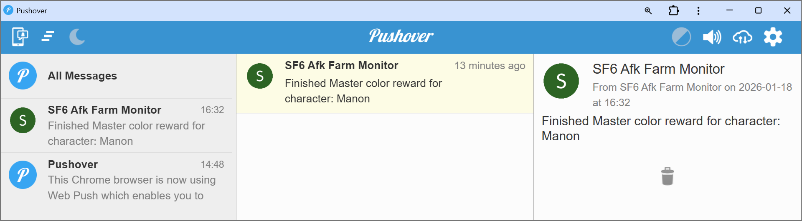

# SF6 Afk Farm Monitor

This app helps the SF6 Afk Farm by checking for

1. When the afk farm is stuck, often due to Capcom error codes or opponent disconnects.
2. When a new Master color is unlocked, and it is time to swap characters.

To achieve this, this app polls the Capcom Buckler API for "battle counts" of each character. Once one of the above two
conditions are met, then a notification is sent via Pushover.

## First Time Setup

1. Make a copy of the `example.toml`. Name the new file `config.toml`.
2. Inside `config.toml`, update the following variables:
    1. user_code
    2. target_season_id
    3. buckler_id, buckler_r_id, buckler_praise_date
    4. pushover_app_key, pushover_user_key
3. Feel free to change any other settings inside the TOML file, or leave them at their defaults.

`target_season_id` is the Buckler season to query. Update it when Capcom starts recording battle counts under a new
season.

### Stuck-farm alerts (emergency priority)

A stuck farm is sent as a Pushover **emergency-priority** alert: Pushover re-delivers it until you acknowledge it on
your phone, and the app sends exactly one alert per incident instead of one per poll. Three optional settings tune this
(see `ALERT_DEDUPLICATION_PROPOSAL.md` for the full design):

- `emergency_retry` (default `120`): how often, in seconds, Pushover re-delivers an unacknowledged alert (minimum 30).
- `emergency_expire` (default `10800`): how long, in seconds, Pushover keeps re-delivering before giving up (max 10800
  = 3 hours). If an alert expires unacknowledged while the farm is still stuck, the app raises a fresh one.
- `re_alert_after_ack` (default `600`): after you acknowledge an alert but the farm hasn't actually recovered yet,
  re-alert this many seconds later (an on-call style ack timeout). Set `0` to disable.

Acknowledging an alert only silences Pushover's re-delivery — the incident closes (and any remaining nagging is
cancelled) only when the app observes the farm recover (a battle count increments again).

### Master-color swap alerts (emergency priority)

When a character's battle count crosses 100 (Master color complete), the app opens an emergency incident telling you to
swap characters. It nags until a *different* character starts gaining battles — i.e. you actually swapped — so you get
one alert per swap instead of one notification per match played past 100. Continued matches on the finished character
keep the incident open and silent. It shares the same `emergency_retry` / `emergency_expire` / `re_alert_after_ack`
tuning as stuck-farm alerts, and the notification deep-links straight to your Buckler profile.

> **Deployment note:** emergency priority does *not* bypass your phone's OS-level Do Not Disturb by default. To let an
> emergency alert (stuck-farm or Master-color swap) wake you overnight, enable **Critical Alerts** for Pushover on iOS,
> or allow Pushover's alarm sound and DND override on Android.

## Getting Buckler Variables

When you log into the CFN website (https://www.streetfighter.com/6/buckler/en/), there are three Buckler variables
stored inside the Request Cookies. You can use your browser's Network Inspector to inspect your HTTP requests and copy
these variables.

## Usage

Step 1: Run the app in your terminal:

```shell
uv sync
uv run python app.py
```

Example running output:

```Powershell
2026-01-18 16:21:23,839 | INFO | __main__ | Scheduling task for every 60 seconds...
2026-01-18 16:28:28,127 | INFO | task | Character (Manon) has a new battle count: 96 -> 97
2026-01-18 16:29:28,700 | INFO | task | Character (Manon) has a new battle count: 97 -> 98
2026-01-18 16:31:29,952 | INFO | task | Character (Manon) has a new battle count: 98 -> 99
2026-01-18 16:32:30,535 | INFO | task | Character (Manon) has a new battle count: 99 -> 100
2026-01-18 16:32:30,535 | INFO | task | Finished Master color reward for character: Manon
2026-01-18 16:33:31,281 | INFO | task | Character (Manon) has a new battle count: 100 -> 101
2026-01-18 16:35:32,197 | INFO | task | Character (Kimberly) has a new battle count: 0 -> 1
2026-01-18 16:36:32,780 | INFO | task | Character (Kimberly) has a new battle count: 1 -> 2
2026-01-18 16:37:33,333 | INFO | task | Character (Kimberly) has a new battle count: 2 -> 3
```

Example Pushover notification:

