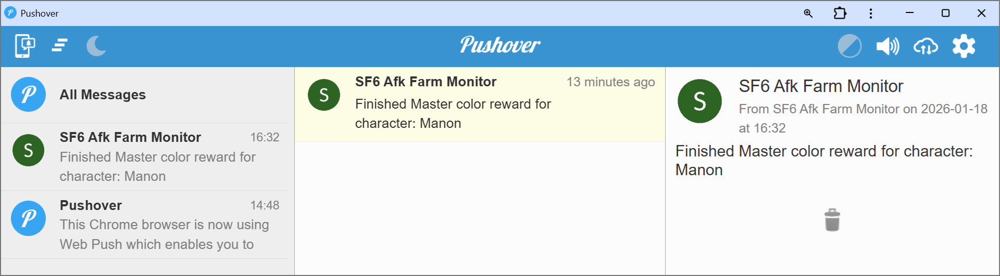

# SF6 Afk Farm Monitor

This app helps the SF6 Afk Farm by checking for

1. When the afk farm is stuck, often due to Capcom error codes or opponent disconnects.
2. When a new Master color is unlocked, and it is time to swap characters.

To achieve this, this app polls the Capcom Buckler API for each character's "battle count" and Master Pass points. Once
one of the above two conditions are met, then a notification is sent via Pushover.

## First Time Setup

1. Make a copy of the `example.toml`. Name the new file `config.toml`.
2. Inside `config.toml`, update the following variables:
    1. user_code
    2. target_season_id
    3. buckler_id, buckler_r_id, buckler_praise_date (or keep the `example.toml` placeholders and fill them
       with `login.py` — see [Getting Buckler Variables](#getting-buckler-variables))
    4. pushover_app_key, pushover_user_key
3. Feel free to change any other settings inside the TOML file, or leave them at their defaults.

`user_code` must be the account you log into Buckler as. Buckler serves Master Pass points only for the logged-in
account, so the monitor refuses to start on another account's cookies.

`target_season_id` is the Buckler season to query, for both the battle counts and the Master Pass. Update it when Capcom
starts a new season. While it names a season with no open Master Pass, every poll fails and the monitor raises its
API-down alert, which lists the seasons Buckler returned and tells you to check `target_season_id`.

### Stuck-farm alerts (emergency priority)

A stuck farm is sent as a Pushover **emergency-priority** alert: Pushover re-delivers it until you acknowledge it on
your phone, and the app sends exactly one alert per incident instead of one per poll. Three optional settings tune this
(see `ALERT_DEDUPLICATION_PROPOSAL.md` for the full design):

- `emergency_retry` (default `120`): how often, in seconds, Pushover re-delivers an unacknowledged alert (minimum 30).
- `emergency_expire` (default `10800`): how long, in seconds, Pushover keeps re-delivering before giving up (max 10800
  = 3 hours). If an alert expires unacknowledged while the farm is still stuck, the app raises a fresh one.
- `re_alert_after_ack` (default `600`): after you acknowledge an alert but the farm hasn't actually recovered yet,
  re-alert this many seconds later (an on-call style ack timeout). Set `0` to disable.

Acknowledging an alert only silences Pushover's re-delivery — the incident closes (and any remaining nagging is
cancelled) only when the app observes the farm recover (a battle count increments again).

### Master-color swap alerts (emergency priority)

When a character's Master Pass points reach 100 (Master color unlocked), the app opens an emergency incident telling you
to swap characters. The trigger is the points, not the battle count: a battle occasionally awards no point, so the battle
count can reach 100 a battle or two before the reward unlocks. It nags until a *different* character starts gaining
battles — i.e. you actually swapped — so you get one alert per swap instead of one notification per match played past
100. Continued matches on the finished character keep the incident open and silent. It shares the same
`emergency_retry` / `emergency_expire` / `re_alert_after_ack` tuning as stuck-farm alerts, and the notification
deep-links straight to your Buckler profile.

> **Deployment note:** emergency priority does *not* bypass your phone's OS-level Do Not Disturb by default. To let an
> emergency alert (stuck-farm or Master-color swap) wake you overnight, enable **Critical Alerts** for Pushover on iOS,
> or allow Pushover's alarm sound and DND override on Android.

## Getting Buckler Variables

The three Buckler variables (`buckler_id`, `buckler_r_id`, `buckler_praise_date`) are session cookies set when you log
into the CFN website. There are two ways to get them into `config.toml`.

### Automatic (recommended): `login.py`

```shell
uv sync --group login   # one-time: installs the embedded-browser dependency (pywebview)
uv run python login.py
```

This reads `config.toml`, so it must already exist with `user_code` and `target_season_id` set (copy `example.toml`
first). Leave the three `buckler_*` values as the example placeholders — `login.py` overwrites them. In particular,
keep `buckler_praise_date` numeric: blanking it fails config validation before the browser can open.

A browser window opens at the CFN/Buckler site. Log in normally, as the account named by `user_code` — Capcom ID, plus
any MFA/captcha, are handled right there in the window. Once you're logged in, the window closes itself, the three
cookies are verified against the real API, and they're written into `config.toml` for you. If they belong to a different
account than `user_code`, nothing is written. Nothing is typed by hand and the cookies never leave your machine.
It also prints when the captured cookies are set to expire, so you have a rough idea of when you'll next need to run it.

If `pywebview` isn't installed, `login.py` prints an install hint and you can fall back to the manual steps below.

### Manual (fallback): browser DevTools

Log into https://www.streetfighter.com/6/buckler/en/ as the account named by `user_code`, open your browser's Network
Inspector, and copy the three
variables out of a request's **Request Cookies** header into `buckler_id`, `buckler_r_id`, and `buckler_praise_date`
in `config.toml`.

### Refreshing expired cookies

Buckler session cookies expire periodically — this is routine, not a Capcom outage. When they expire, the monitor can
no longer read your battle counts, so it sends an **emergency-priority** alert:

> Buckler session expired — run `uv run python login.py` to re-capture cookies, then restart the monitor. All
> monitoring is blind until then.

To recover:

1. Re-capture fresh cookies with `uv run python login.py` (or copy them in by hand, as above).
2. **Restart the monitor** (`uv run python app.py`). The cookies are read once at startup, so a running process keeps
   using the old (expired) values until it is restarted.

On the first successful poll after the restart, the app closes the alert and cancels Pushover's re-delivery
automatically — there is nothing to acknowledge.

## Usage

Step 1: Run the app in your terminal:

```shell
uv sync
uv run python app.py
```

Example running output:

```Powershell
2026-01-18 16:21:23,839 | INFO | __main__ | Scheduling task for every 60 seconds...
2026-01-18 16:31:29,952 | INFO | task | Character (Manon) has a new battle count: 98 -> 99
2026-01-18 16:31:29,952 | INFO | task | Character (Manon) has new Master Pass points: 98 -> 99
2026-01-18 16:32:30,535 | INFO | task | Character (Manon) has a new battle count: 99 -> 100
2026-01-18 16:32:30,535 | INFO | task | Character (Manon) has new Master Pass points: 99 -> 100
2026-01-18 16:32:30,535 | INFO | task | Finished Master color reward for character: Manon
2026-01-18 16:33:31,281 | INFO | task | Character (Manon) has a new battle count: 100 -> 101
2026-01-18 16:33:31,281 | INFO | task | Character (Manon) has new Master Pass points: 100 -> 101
2026-01-18 16:35:32,197 | INFO | task | Character (Kimberly) has a new battle count: 0 -> 1
2026-01-18 16:35:32,197 | INFO | task | Character (Kimberly) has new Master Pass points: 0 -> 1
```

Example Pushover notification:


## Status page

An optional local web page shows live farm progress at a glance: a per-character table with progress bars for Master
Pass points out of 100 (unfinished characters first), the finished-character tally, how long it has been since the last
battle-count change, and the current health (OK / stuck / API down / auth expired). The character being farmed is
highlighted: its row is tinted, its bar takes its own color, and a progress icon sits left of its name where finished
characters show a checkmark. It is the last character the monitor saw gain a battle, so after a swap the highlight moves
once the new character finishes its first match. It is a **separate, read-only process** from the monitor — it only
reads `data/database.json` and `data/notification_state.json`, so it never affects monitoring and can be started or
stopped independently of `app.py`.

Start it in its own terminal:

```shell
uv run python status_server.py
```

Then open `http://localhost:8675` on the PC, or `http://<pc-ip>:8675` from a phone on the same Wi-Fi. The page
re-fetches every 30 seconds; `GET /api/status` returns the same data as JSON.

- The port is the `status_page_port` config key (default `8675`; omit it to use the default). Avoid `8080` if Steam is
  running, as it occupies that port.
- The server binds `0.0.0.0` for LAN access, so the **first** time you reach it from another device Windows will show a
  Firewall prompt — allow it on **Private** networks.
- There is no authentication; it is intended for your LAN only. Do not port-forward or otherwise expose it to the
  internet (it serves only character battle counts and points, never your `config.toml`).

## Data and logs

All generated state lives under the repository directory, anchored to the source location so the monitor behaves the
same regardless of the working directory it is launched from:

- `config.toml` (repository root) — your settings and secrets. You create this from `example.toml`; it is gitignored.
- `data/database.json` — the per-character battle counts and Master Pass points. This is the single state artifact that
  the monitor and the status page share.
- `data/notification_state.json` — incident / alert-deduplication state (open incidents and the stuck-farm timer), plus
  the characters that last gained a battle, which the status page highlights.
- `logs/info.log` and `logs/debug.log` — rotating run logs (`debug.log` is far chattier and rotates on a larger
  budget).

The `data/` and `logs/` directories are created automatically on first run, and both are gitignored.
